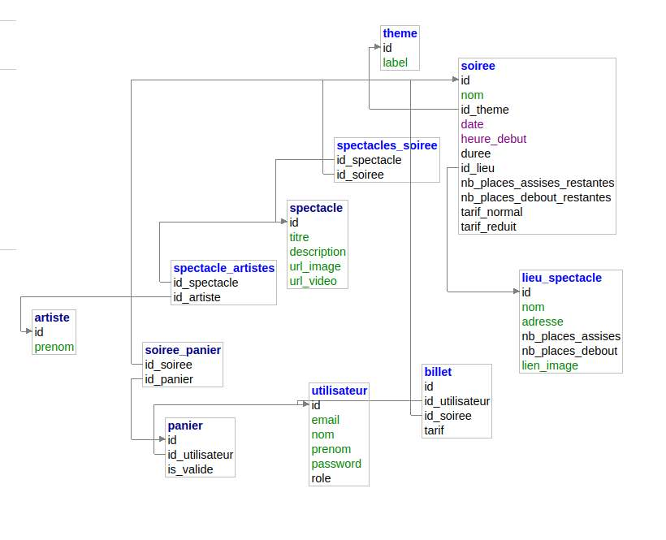

# NRV
DAZA Sasha  
DURAND Quentin  
GEORGES Vincent  
PINOT Gaëtan  
PRYKHODKO Yehor  
## Liens:
### Docketu:
- API [http://docketu.iutnc.univ-lorraine.fr:44010](http://docketu.iutnc.univ-lorraine.fr:44010)  
- WEB [http://docketu.iutnc.univ-lorraine.fr:44013](http://docketu.iutnc.univ-lorraine.fr:44013)  
- BACKOFFICE [http://docketu.iutnc.univ-lorraine.fr:44015](http://docketu.iutnc.univ-lorraine.fr:44015)  

## Modèle de la base de donnée:
Le schéma peut aussi être retrouvé en detail de le fichier de construction `./app/src/infrastructure/genereDb.php`  

## Données
email `user@mail.com`  
mot de passe `1234`  

## Tableau de bord
### Fonctionnalité de base :
#### Programme du festival:
- Affichage de la liste des spectacles : pour chaque spectacle, on affiche le titre, la date et l’horaire, une image.  
Sasha, Yehor
- Affichage du détail d’une soirée : nom de la soirée, thématique, date et horaire, lieu, tarifs, ainsi que la liste des spectacles : titre, artistes, description, style de musique, vidéo.  
Sasha
- En cliquant sur un spectacle dans la liste, le détail de la soirée correspondante est affiché.  
- Filtrage de la liste des spectacles par date.  
Sasha, Vincent  
- Filtrage de la liste des spectacles par style de musique.  
Sasha, Vincent  
- Filtrage de la liste des spectacles par lieu.  
Sasha, Vincent  
### Compte et Profil d’utilisateur :
- Inscription sur la plateforme et création d’un compte.  
Yehor, Quentin
- Accès aux billets achetés (« mes billets »).  
Quentin
### Achats de billets :
- Lors de la visualisation d’une soirée, possibilité d’ajouter des billets d’entrée pour cette soirée dans un panier.
Quentin
- Visualisation de l’état courant du panier, calcul et affichage du montant total.
Quentin 
- Validation du panier et transformation en commande, validation de la commande.  
- Paiement de la commande : on simule en transmettant des données correspondant à une carte bancaire : n°, date expiration, code ; le contrôle de disponibilité des places est réalisé à ce moment-là, ainsi que la mise à jour du nombre de places disponibles pour la soirée.  
- Création des billets qui doivent comporter : nom de l’acheteur, référence, date et horaire de la soirée, catégorie de tarif ; les billets doivent être imprimables et peuvent être réalisés en html/css avec @media print.  
### Backoffice :
- Affichage de la jauge des spactacles:nombre de places vendues pour chaque soirée  
Gaëtan, Yehor
## Fonctionnalités étendues
- Pagination de la liste de spectacles.  
Gaëtan, Sasha
- Modification du panier : nombre de billets.  
- Backoffice : ajouter des spectacles et des soirées.  
Gaëtan, Yehor
- Backoffice : gérer les lieux et le nombre de places sur chaque lieu.
- Backoffice : vente de billets à l’entrée des soirées. L‘application est utilisée par l’organisateur du festival pour la vente de billets sur le lieu de chaque soirée.
- Panier persistant : possibilité d’ajouter des réservations qui sont conservées au-delà de la session jusqu’au paiement.
- Vérification des places disponibles dans un panier avant paiement.
